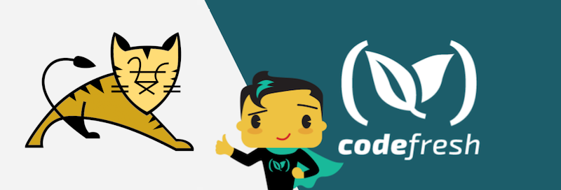

# Deploying an Application to Tomcat using SCP and Codefresh

[Original source](https://github.com/kliakos/sparkjava-war-example)

This is a simple Hello World application using the [Spark Java framework](http://sparkjava.com/).

## Prerequisites

- A [free Codefresh account](https://codefresh.io/docs/docs/getting-started/create-a-codefresh-account/)
- A distribution of [Tomcat](https://tomcat.apache.org/download-90.cgi) setup on a remote/local server (running with port 8080 exposed, if you are not running this locally)

## Build/Deploy Locally

1. Run `mvn clean package`
2. Copy the war file from the /target directory into the Tomcat 'webapps' directory
3. Access the application at [http://localhost:8080/sparkjava-hello-world-1.0/hello](http://localhost:8080/sparkjava-hello-world-1.0/hello) in your browser

## Build in Codefresh

[Example pipeline](codefresh.yml)
